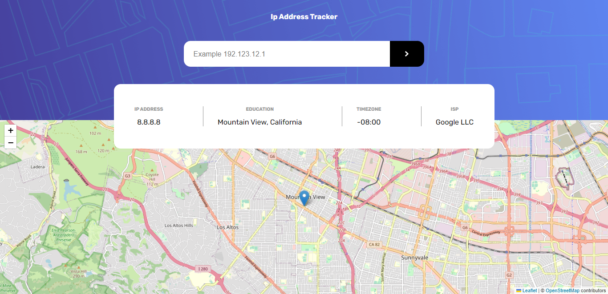

# Ip address tracker 

Users should be able to search for any Ip address

## Table of contents

  - [Screenshot](#screenshot)
  - [Links](#links)
  - [Built with](#built-with)
  - [Author](#author)

### Screenshot

### Links

live site url: [Ip Address Tracker](https://newt-tracker.netlify.app/)

### Biult with

- Semantic HTML5 markup
- CSS custom properties 
- Flexbox
- CSS Grid
- Mobile-first workflow
- React
- React Hooks
-APIs
    -[Leaflet-Api] (https://leafletjs.com/)
    -[GeoIpfy-Api] (https://geo.ipify.org/)

## Author

- Frontend Mentor - [@newton-w](https://www.frontendmentor.io/profile/newton-w)
- Twitter - [@newton_warui](https://www.twitter.com/newton_warui)

# Run the Project
    npm install
    npm start